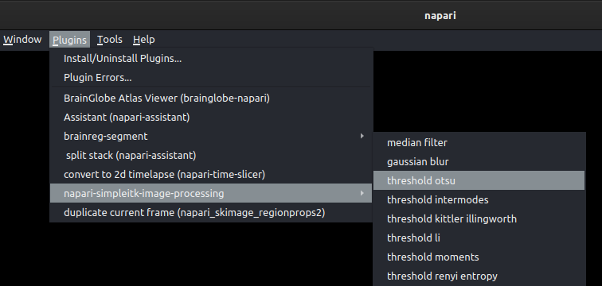

# Analyze and visualize bulk fluorescence tracing data
Analysis and visualization of tracing data (e.g., anterograde or retrograde) in brains imaged post-hoc in a standard 
coordinate space.

## Introduction

The primary objective of tracing experiments in neuroscience is to elucidate the pathway specificity and establish 
connection relationships between neurons and various brain areas. By understanding these intricate connections, we can 
gain a deeper understanding of how the brain generates behavior. Therefore, it becomes imperative to quantify 
bulk-labeled axonal projections in images, as this process serves as a fundamental step in unraveling the intricate 
web of neuronal connectivity and its corresponding functionality.

Here we present a tool for the analysis of tracing axonal projections in post-hoc brain imaging data within a 
common coordinate space. This tool is integrated into brainreg, within the Brainglobe suite of 
computational neuroanatomy tools. Leveraging existing segmentation plugins available in napari, our 
tool imports and integrates these segmentation results into BrainGlobe, allowing for comprehensive 
analysis of bulk axonal projections within the context of an anatomical atlas.

## Before tracing bulk axonal tracks

**Tracing Compound Selection:** Choose an appropriate tracing compound (or multiple ones if you plan to use different 
colors) based on the specific requirements of your experiment. 

**Injection:** Carefully inject the tracing compound into the target region of the brain. The compound should be injected 
in a controlled manner to ensure accurate delivery and minimize damage to surrounding tissue.

**Incubation:** Allow sufficient time for the tracing compound to be taken up by neurons and transported along the axonal 
projections. The duration of the incubation period can vary depending on the specific compound and experimental requirements.

**Tissue Processing:** Sacrifice the animal and extract the brain for further processing. The animal is anaesthetised and 
perfused with 4% PFA following standard perfusion protocols. The brain is carefully extracted and left in 4% PFA overnight.

:::{note}
To ensure high quality image registration, it is essential that the brain is properly perfused in order to decrease 
the autofluorescence of blood vessels. It is also important that the brain is extracted from the skull carefully in 
order to avoid tissue damage.
:::

The brain is then thoroughly washed with 100mM PBS and imaged (e.g. by 
[Serial 2-Photon Tomography](https://sainsburywellcomecentre.github.io/OpenSerialSection/acquisition/)). Image channels 
as needed according to number of tracing compounds (and extra channel is acquired as the background fluorescence only).


## Brain registration to an atlas

To track the bulk axonal projections into the standard space, the brain must first be registered to an atlas using brainreg.

Before registration, brainreg needs to be installed, please follow the instructions 
[here](/documentation/brainreg/installation). Once installed, we can proceed to register the imaged brain.

:::{note}
Make sure you activate your conda environment before starting
:::

You will need:

1. The path where the brain image stack (signal channels) is located
2. The path where the brain stack (background fluorescence channel) is located
3. The path where you want the registration result to be saved
4. The resolution at which the brain was imaged 

**To register your brain to an atlas, please follow the instructions for brainreg (using the napari plugin)
[here](/documentation/brainreg/user-guide/brainreg-napari)**.


A new output directory has been created, which contains the registered brain. We are now ready to use external plugins 
to find a mask that covers the axonal projections.


## Bulk axonal track detection

Before we can proceed to register the axonal tracks in the imaged brain we need to install additional Napari plugins. 
In this tutorial we will use the 
[`napari-simpleitk-image-processing`](https://www.napari-hub.org/plugins/napari-simpleitk-image-processing) plugin. This 
plugin can either be installed via the [napari plugin menu](https://napari.org/stable/plugins/find_and_install_plugin.html) 
or directly from PyPI on the command-line:
```
pip install napari-simpleitk-image-processing
```

:::{note}
Alternative plugins can be used to generate the segmentation mask for the area of interest. In this case, we will use 
the Otsu[^1] thresholding method from `napari-simpleitk-image-processing` an example.
:::

[^1]: Otsu (1979) IEEE Transactions on Systems, Man and Cybernetics. Vol SMC-9, No 1, p62

To use Otsu's method from the `napari-simpleitk-image-processing` plugin, follow these steps:

- Open napari
- [Load your data using the `brainreg-segment` plugin](/documentation/brainreg-segment/user-guide/index)
- Choose the Otsu thresholding option from the plugin menu:




- Apply the Threshold-Otsu method: This method automatically calculates an optimal threshold value based on the Otsu 
algorithm.
- Adjust the threshold (if necessary): Optionally, you may have the flexibility to adjust the threshold value obtained 
from the Otsu algorithm. This step allows you to fine-tune the threshold to best suit your image and analysis requirements.
- Generate the segmentation mask: Once you have set the threshold value, apply the Threshold-Otsu method to the image. 
The plugin will process the image using the specified threshold and generate a segmentation mask based on the Otsu 
algorithm.
- Save the generated mask


## Bulk axonal track tracing

To open the graphical user interface, open napari and then load the `brainreg-segment` plugin (see 
[User guide](/documentation/brainreg-segment/user-guide/index)).

The `brainreg-segment`graphical user interface opens and shows a set of tools.You can then load your brainreg output 
directory, and follow the main `brainreg-segment` documentation 
[here](/documentation/brainreg-segment/user-guide/analysing-external-segmentation) for anaysing layers segmented by 
other napari plugins. 

**Instructions by** [**Sara Mederos**](https://www.sainsburywellcome.org/web/people/sara-mederos).
